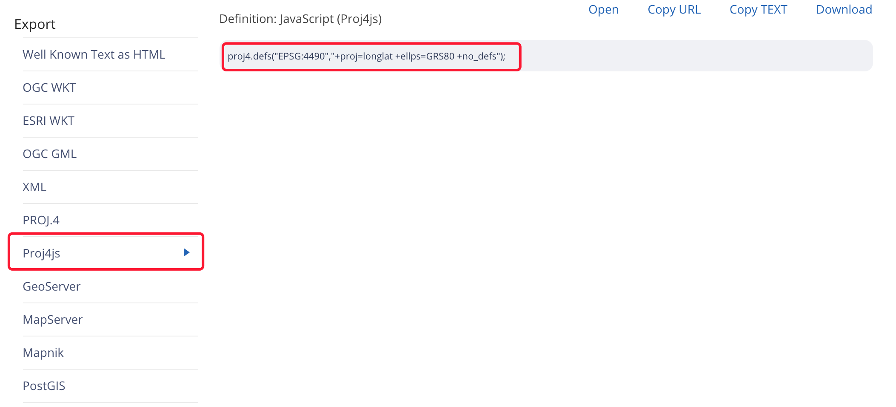

# OpenLayers 学习记录

## 默认支持坐标系

OpenLayers默认只支持EPSG:4326和EPSG:3857，那想让它支持CGCS2000坐标系该怎么办？
这个时候就需要自定义坐标系了，借助proj4.js（proj4js是一个转换点坐标从一个坐标系到另一个坐标系的JavaScript库，包括数据转换）即可实现

- 在项目中安装proj4
```js
yarn add proj4
```

- 在[http://epsg.io/](http://epsg.io/)中查询目标坐标系的定义


- 在代码中定义当前坐标系

```js
import proj4 from ‘proj4’;
import { register } from "ol/proj/proj4";
import { Projection } from "ol/proj";

// 自定义坐标系，并注册到openlayers
proj4.defs("EPSG:4490", "+proj=longlat +ellps=GRS80 +no_defs”);

// 使用register方法进行坐标系注册
register(proj4);
```

## View视图默认坐标系

::: warning 注意

View视图对象默认的坐标系是球型墨卡托投影，即 ESPG:3857。
因此如果要支持CSGC2000的坐标系需要在View视图对象中定义投影的类型

:::